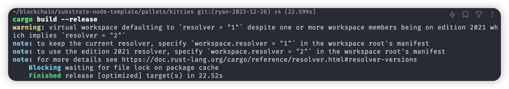
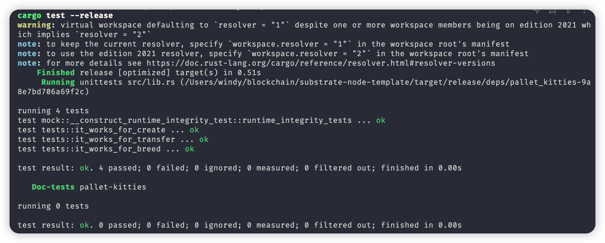
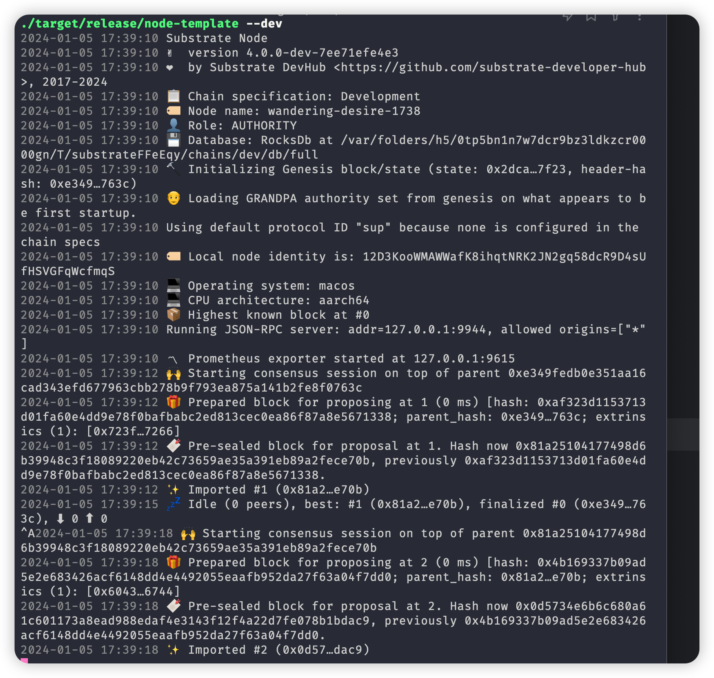
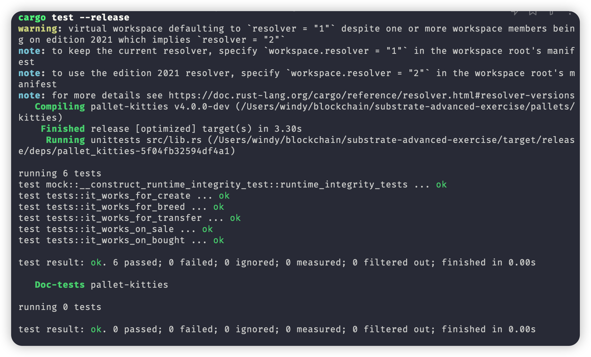
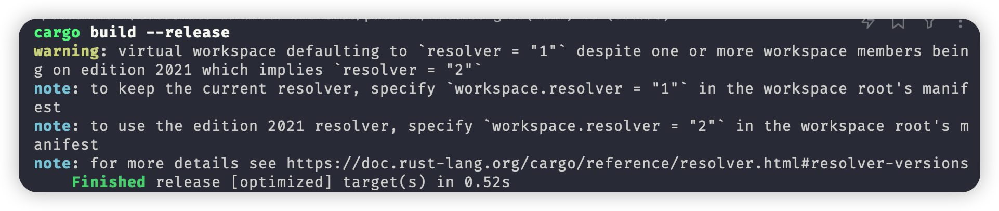
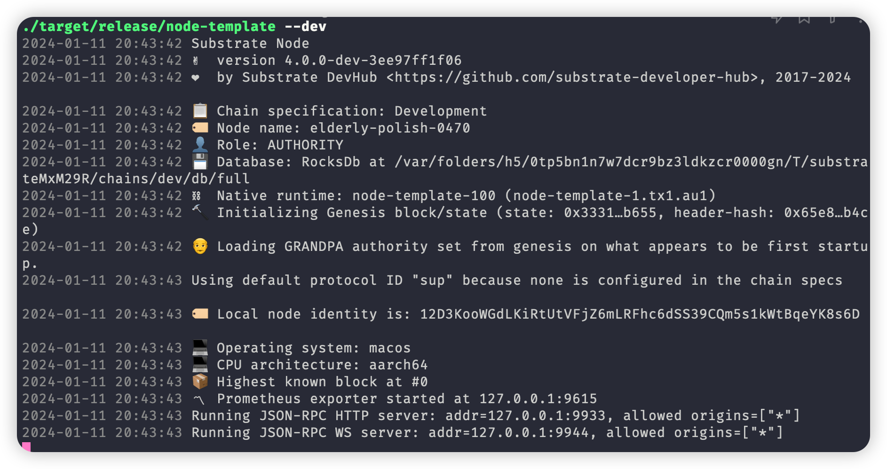
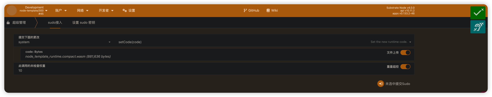
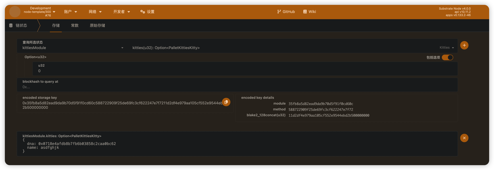
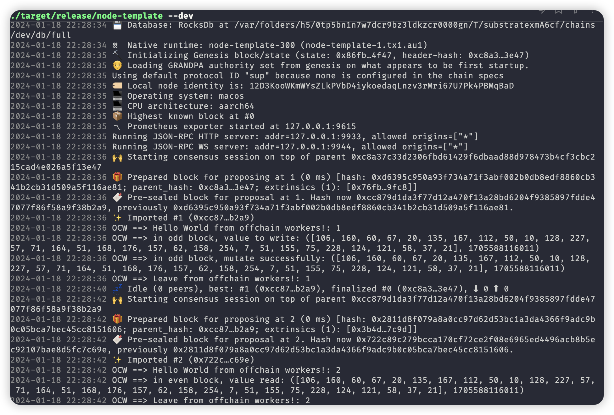
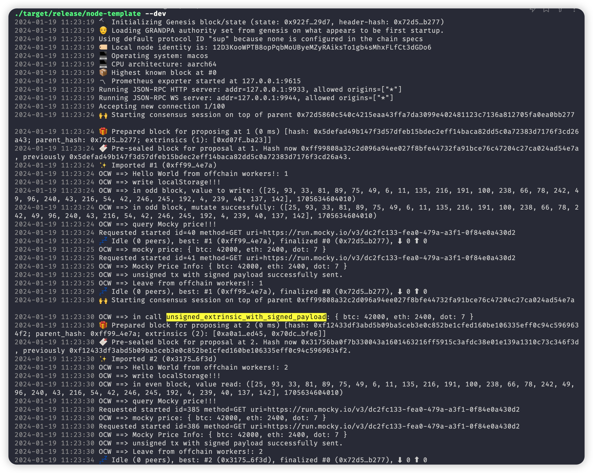

### week1

* snapshot

### week2

Q1:
· Pallet编译成功
  
· 单元测试通过
  
· 加入kitties pallet到runtime中,node可以编译通过
  
· node节点可以正常启动
  

Q2:
· 单元测试通过
  

### week3

Q1:
· 单元测试通过
  
· 编译通过
  
· 节点启动
  

Q2:
· 升级
  
· 验证
  

### week4
Q1:
1. 链上随机数：通常是通过区块链交易的输入参数、区块头数据或区块链状态的信息等等计算的。因为他具有可验证性和确定性，任何参与者都能验证随机数的产生。它通常适用于一些需要公开、可验证的随机数生成场景，比如抽奖或者竞拍等等。
2. 链下随机数：它的生成与区块链本身无关，依赖外部的随机事件，物理设备等等。所以它具有更高的随机性，链下随机数无法被区块链网络的参与者验证和确定，它通常被用于需要高随机性但不需要被验证的场景，比如密码学应用、游戏中的随机事件等等

Q2:
· 运行结果
  

Q4: 
· 运行结果
  
